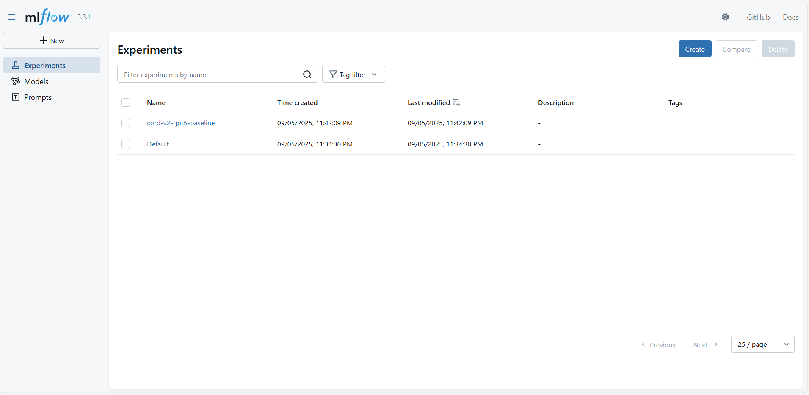
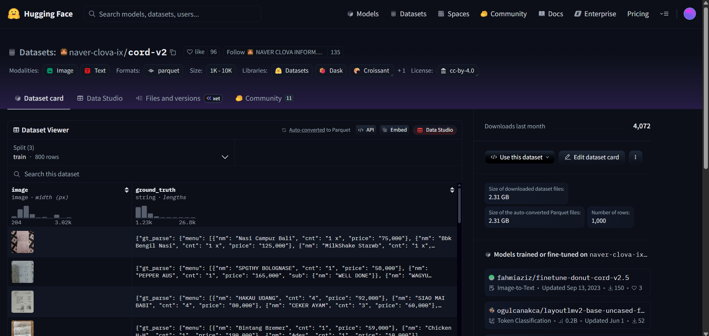
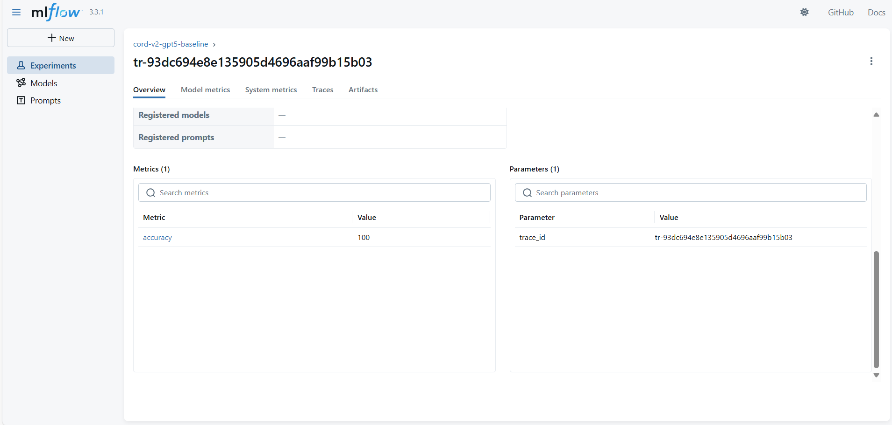
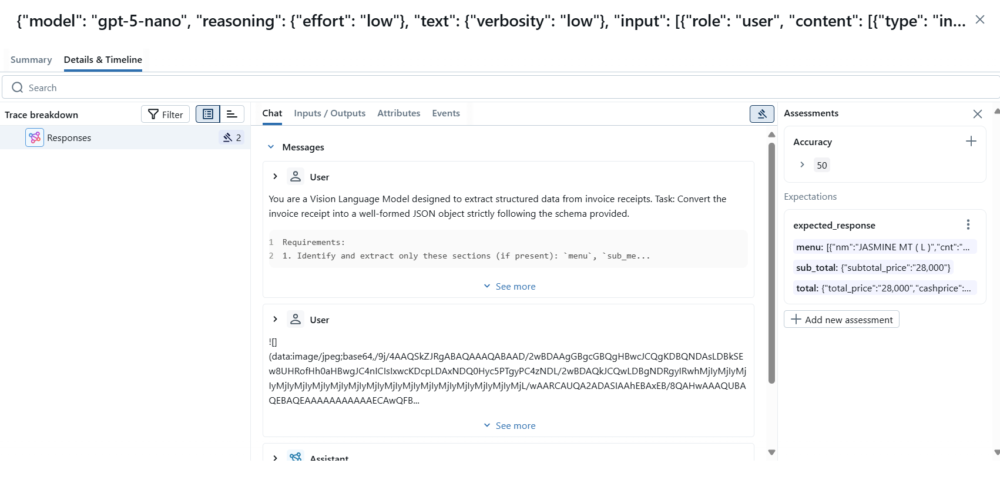
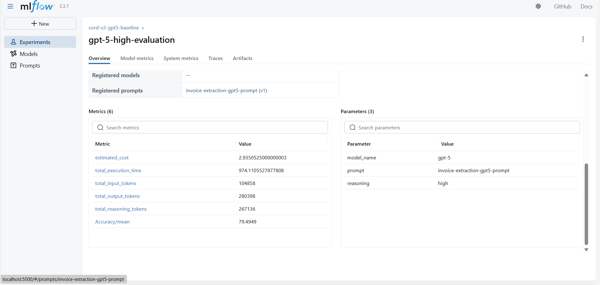
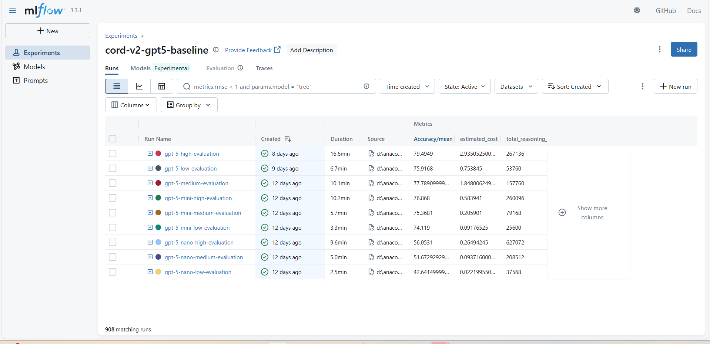
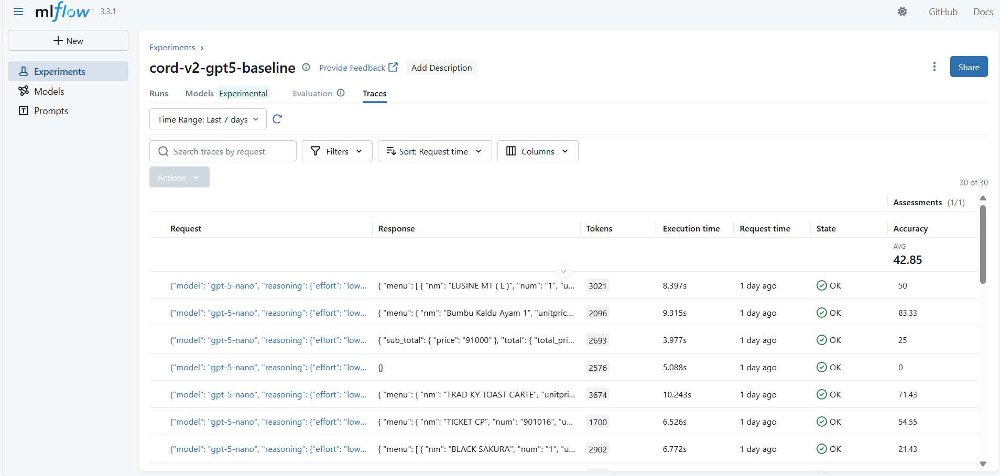
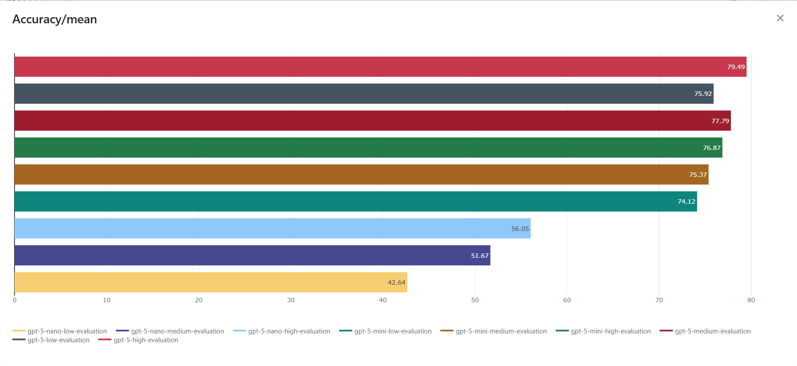
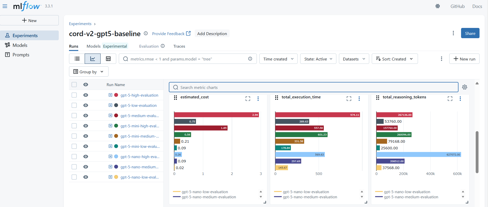
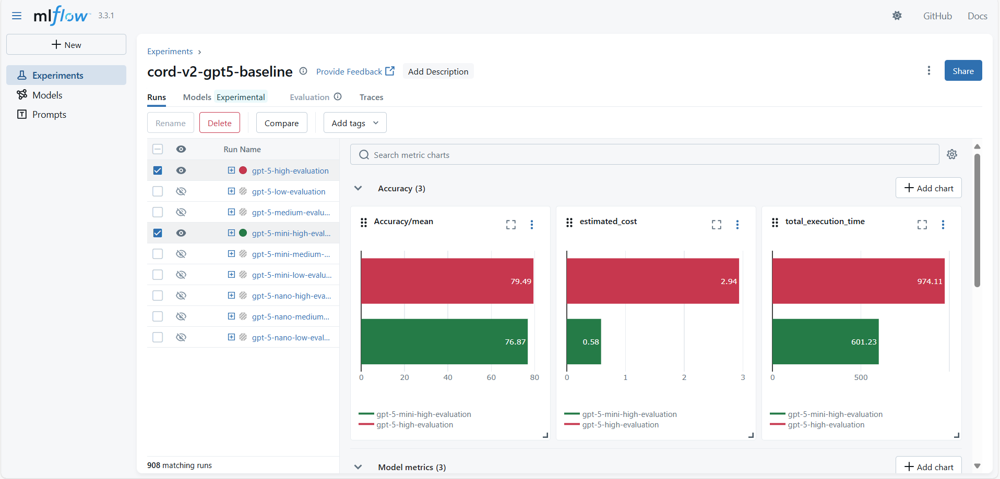

## Introduction
This example demonstrates how to leverage MLflow for experimenting with Google's Gemini 2.0 Flash model on the invoice extraction task, using the CORD-v2 dataset. The code has been updated to use LangChain for seamless integration with Google's Generative AI.

The goal is not only to compare model performance, but also to showcase how MLflow can streamline the entire workflow with:

* Prompt Versioning – Track different prompt templates used for extraction.

* Tracing & Logging – Capture inputs, outputs, and intermediate steps for reproducibility.

* Evaluation Metrics – Record accuracy, consistency, and cost trade-offs for each experiment.

### Dataset

We use the CORD-v2 dataset available on Hugging Face: [CORD-v2 on HuggingFace](https://huggingface.co/datasets/naver-clova-ix/cord-v2).

For this experiment, we focus exclusively on the test split, which contains 100 invoice samples. This subset provides a standardized experiments for evaluating invoice field extraction using Gemini 2.0 Flash, while keeping the experiment lightweight and reproducible.

The dataset is under [Creative Commons Attribution 4.0 International
License][cc-by].

[![CC BY 4.0][cc-by-image]][cc-by]

[cc-by]: http://creativecommons.org/licenses/by/4.0/
[cc-by-image]: https://i.creativecommons.org/l/by/4.0/88x31.png
[cc-by-shield]: https://img.shields.io/badge/License-CC%20BY%204.0-lightgrey.svg


### Prerequisites

#### Start the MLflow server

Run the following command to start the MLflow server
```
mlflow server --host 127.0.0.1 --port 8080
```

#### Setting Google AI environment

Create a new file `.env` and paste your Google AI API key

```
GOOGLE_API_KEY=<GOOGLE-AI-API-KEY>
```

### Running the experiment

Open the [cord_v2_gemini_baseline_mlflow.ipynb](./cord_v2_gemini_baseline_mlflow.ipynb) notebook.

Install the necessary dependencies mentioned in the notebook.

The provided Jupyter notebook walks through the full benchmarking workflow step by step. It is organized into the following sections:  


1. **Set the configrations**
   - Set the MLflow, Google AI and prompt configurations here.
   

2. **Register prompt and model**
   - Register the system prompt in MLflow
   

3. **Load the Dataset**  
   - Downloads and loads the **CORD-v2** dataset from Hugging Face.  
   

4. **Data Preparation**  
   - Selects the number of samples to evaluate.  
   - Prepares the invoice data in a model-ready format for inference.

5. **Deriving individual invoice level metrics**  
   - Calculate the accuracy of the individual invoice
   

6. **Tracing Gemini API calls**  
   - Tracing individual invoice extraction parameters - request, response, metadata
   

5. **Logging model level metrics**  
   - Logging aggregated metrics for comparison
   


Overall model comparison can be done at the experiment level


Overall trace comparison can be done by clicking the "Traces" Tab


Overall model metrics



Best performing models


### Key Changes Made

This codebase has been updated to use Google's Gemini 2.0 Flash model via LangChain instead of OpenAI's GPT-5. Key changes include:

- **Model Integration**: Replaced OpenAI client with `ChatGoogleGenerativeAI` from LangChain
- **Message Format**: Updated to use LangChain's `HumanMessage` format for multimodal inputs
- **Token Usage**: Adapted token usage tracking for Gemini's response format
- **Cost Tracking**: Added Gemini pricing to the cost.json file
- **Configuration**: Updated model name and experiment names to reflect Gemini usage

### Testing

A test script `test_gemini_integration.py` is provided to verify the Gemini integration works correctly. Run it to test:

```bash
python test_gemini_integration.py
```

