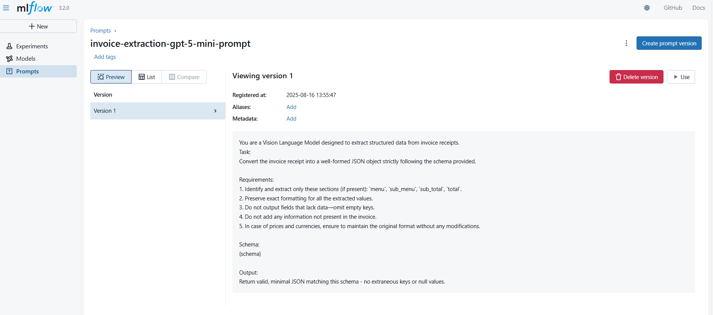

## Introduction
This example demonstrates how to leverage MLflow for benchmarking OpenAI’s GPT-5-mini and GPT-5-nano models on the invoice extraction task, using the CORD-v2 dataset.

The goal is not only to compare model performance, but also to showcase how MLflow can streamline the entire benchmarking workflow with:

Prompt Versioning – Track different prompt templates used for extraction.

Model Versioning – Log and compare GPT-5-mini and GPT-5-nano runs seamlessly.

Tracing & Logging – Capture inputs, outputs, and intermediate steps for reproducibility.

Evaluation Metrics – Record accuracy, consistency, and cost trade-offs for each experiment.

### Dataset

We use the CORD-v2 dataset available on Hugging Face: [CORD-v2 on HuggingFace](https://huggingface.co/datasets/naver-clova-ix/cord-v2).

For this experiment, we focus exclusively on the test split, which contains 100 invoice samples. This subset provides a standardized benchmark for evaluating invoice field extraction using GPT-5-mini and GPT-5-nano, while keeping the experiment lightweight and reproducible.

The dataset is under [Creative Commons Attribution 4.0 International
License][cc-by].

[![CC BY 4.0][cc-by-image]][cc-by]

[cc-by]: http://creativecommons.org/licenses/by/4.0/
[cc-by-image]: https://i.creativecommons.org/l/by/4.0/88x31.png
[cc-by-shield]: https://img.shields.io/badge/License-CC%20BY%204.0-lightgrey.svg


### Steps for benchmarking

#### Start the MLflow server

Run the following command to start the MLflow server
```
mlflow server --host 127.0.0.1 --port 8080
```

#### Setting OpenAI environment

Create a new file `.env` and paste your OPENI key

```
OPENAI_API_KEY=<OPENAI-API-KEY>
```

#### Benchmarking

Open the [cord_v2_gpt5_mlflow.ipynb](./cord_v2_gpt5_mlflow.ipynb) notebook.

Install the necessary dependencies mentioned in the notebook.


The provided Jupyter notebook walks through the full benchmarking workflow step by step. It is organized into the following sections:  

Register Prompt and OpenAI model

Run the [log_model_and_prompt.ipynb](./log_model_and_prompt.ipynb) notebook to register a new prompt and log the OpenAI model.




1. **Set the configrations**
   - Set the MLflow, OpenAI and prompt configurations here.

2. **Register prompt and model**
   - Register the system prompt in MLflow
   - Register the OpenAI model in MLflow

3. **Load the Dataset**  
   - Downloads and loads the **CORD-v2** dataset from Hugging Face.  

4. **Data Preparation**  
   - Selects the number of samples to evaluate.  
   - Prepares the invoice data in a model-ready format for inference.  

4. **Inference and Evaluation**  
   - Loads the saved OpenAI model versions tracked in **MLflow**.  
   - Performs inference using the confirguration mentioned in step 1

5. **Calculate Number of Tokens**  
   - Computes total **input and output tokens**.  
   - Estimates **cost of inference** based on token usage.  

6. **Publish summary**  
   - Publish the summary such as **input, output tokens, invoice level metrics, key level metrics**

The individual invoice extractions can be tracked in the Traces tab


Overall model summary can be tracked in the `<MODELNAME>-summary`


The invoice level metrics are exported as the file


Compare the metrics across models

